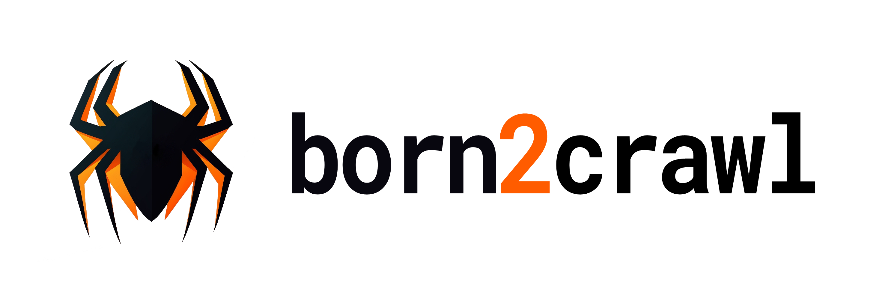
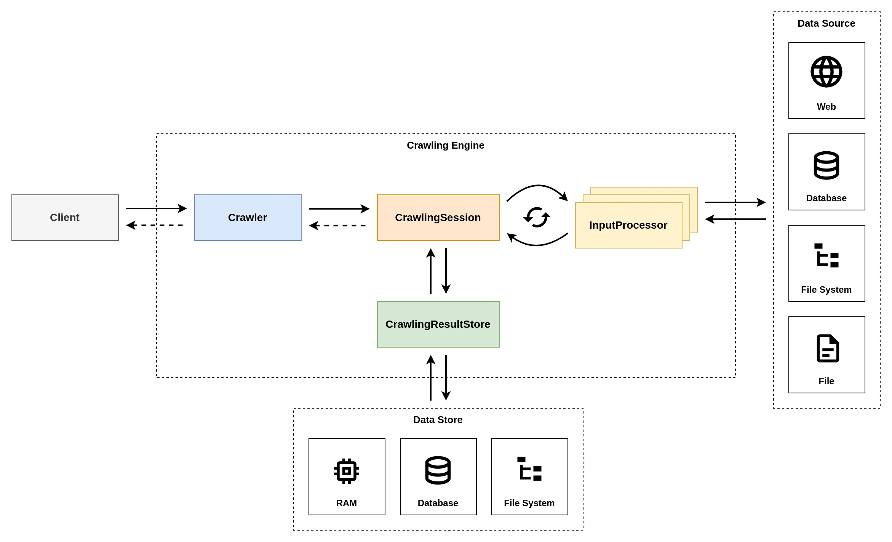
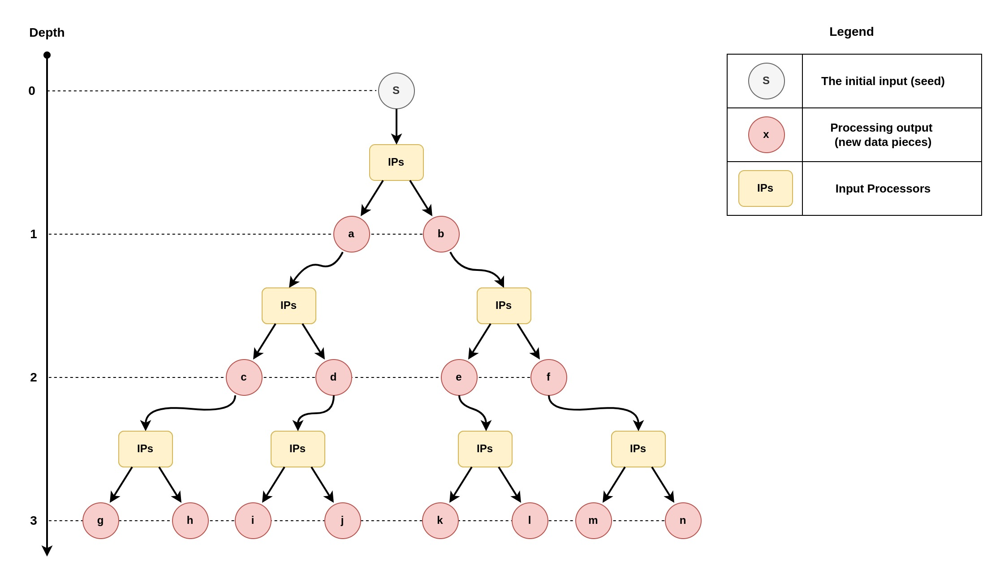

<div align="center">
    
</div>

[](https://mvnrepository.com/search?q=com.arthurivanets.born2crawl-core)
[](https://opensource.org/licenses/Apache-2.0)
[](https://github.com/arthur3486/born2crawl/actions)

**born2crawl** is a highly performant and versatile crawling engine, designed with scalability and extensibility in mind.
It allows you to easily implement a crawling system capable of traversing basically any data source,
including but not limited to web pages, file systems, databases, etc.

## Contents

* [Architecture](#architecture)
* [Modules](#modules)
* [Installation](#installation)
* [Usage](#usage)
  * [Basic Example](#basic-example)
  * [Advanced Example](#advanced-example)
  * [Engine Configuration](#engine-configuration)
  * [Custom InputProcessor](#custom-inputprocessor)
  * [Custom CrawlingResultStore](#custom-crawlingresultstore)
  * [Logging](#logging)
  * [More Examples](#more-examples)
* [Contribution](#contribution)
* [License](#license)

## Architecture



The crawling engine is designed to be highly performant, scalable, and extensible.
To achieve high performance it employs a flexible approach to concurrent processing,
which allows for the efficient handling of multiple crawling requests at the same time.
The scalability and extensibility, on the other hand, are achieved by abstracting away the
logic responsible for the processing of the crawling inputs (crawling of the concrete data sources)
and storing of the crawling results. Such abstraction of the logic allows for easy introduction of
new concrete crawling data sources and result stores without affecting the engine itself, as well as
makes the engine highly versatile.

The engine is built around 4 core entities, namely **Crawler**, **CrawlingSession**,
**CrawlingResultStore**, and **InputProcessor**. Each of these entities play a crucial role
during the crawling.

* [**Crawler**](born2crawl-core/src/main/java/com/arthurivanets/born2crawl/Crawler.kt) - the main client-facing facade used for all interactions with the engine.
It is responsible for the handling of the crawling requests and orchestration of the crawling processes.
* [**CrawlingSession**](born2crawl-core/src/main/java/com/arthurivanets/born2crawl/CrawlingSession.kt) - the entity that does all the crawling.
A single crawling session corresponds to a single crawling request.
* [**CrawlingResultStore**](born2crawl-core/src/main/java/com/arthurivanets/born2crawl/CrawlingResultStore.kt) - the entity that is responsible for the storing of the crawling results.
It is primarily used by the crawling sessions to store the results after successful completion of the crawling process.
* [**InputProcessor**](born2crawl-core/src/main/java/com/arthurivanets/born2crawl/InputProcessor.kt) - the entity that is used for the cyclic processing of the crawling inputs.
It is the entity that incorporates the logic responsible for the crawling of concrete data sources and is used by the crawling sessions to
cyclically process the available information.

The typical crawling flow looks like this:
1. **Client** submits a crawling request to the **Crawler** (crawling engine).
2. **Crawler** extracts the crawling info from the request and starts a new **CrawlingSession**.
3. **CrawlingSession** performs the exhaustive crawling of the info using the registered **InputProcessors**
(the processing is cyclic & involves the re-processing of crawlable data obtained from the **InputProcessors**).
4. **CrawlingSession** composes the crawling result and stores it in the **CrawlingResultStore**.
5. **CrawlingSession** delivers the crawling completion event to the **Crawler**.
6. Crawler destroys the **CrawlingSession** and delivers the crawling result to the **Client**.

## Modules

The project is comprised of the following modules:

* [`born2crawl-core`](born2crawl-core/src/main/java/com/arthurivanets/born2crawl) - the crawling engine.
* [`born2crawl-data-store`](born2crawl-data-store) - persistent storage for crawling results.
* [`born2crawl-web`](born2crawl-web) - tools for web crawling.
* [`born2crawl-samples`](born2crawl-samples/src/main/java/com/arthurivanets/born2crawl/samples) - a set of usage examples.

For information on how to install the library modules see [`Installation`](#installation) section.

## Installation

First, make sure that you've added the `mavenCentral()` repository to your top-level `build.gradle` file:

```groovy
allprojects {
    //...
    repositories {
        //...
        mavenCentral()
        //...
    }
    //...
}
```

Then, add the desired `born2crawl` dependencies:

***Latest version:*** [](https://mvnrepository.com/search?q=com.arthurivanets.born2crawl-core)

```groovy
dependencies {
    // the crawling engine itself
    implementation("com.arthurivanets:born2crawl-core:x.y.z")

    // persistent storage for crawling results
    implementation("com.arthurivanets:born2crawl-data-store:x.y.z")

    // tools for web crawling
    implementation("com.arthurivanets:born2crawl-web:x.y.z")
}
```

## Usage

### Basic Example

All you need to do to begin crawling is create a new instance of a `Crawler` by providing a valid `CrawlingResultStore`
and at least a single concrete `InputProcessor`. Once the `Crawler` is created, you're all set and ready to crawl.

Let's demonstrate this by implementing a `Crawler` that's capable of crawling the Wikipedia pages and extracting all
urls that are pointing to other articles (will use the tools from the `born2crawl-web` module for this example).

```kotlin
object WikiPageProcessor : PageProcessor {
    override fun invoke(page: Document, input: CrawlingInput, context: CrawlingContext): List<Map<String, InputProcessor.ValueHolder>> {
        return page.select("a.mw-redirect")
            .map { element -> ("https://en.wikipedia.org" + element.attr("href")) }
            .map { url -> crawlableDataOf("url" to url) }
    }
}

val resultStore = InMemoryCrawlingResultStore()

// creating an instance of a crawling engine
val crawler = Crawler(
    Crawler.Config(
        inputProcessors = setOf(
            // providing an instance of an InputProcessor that's
            // designed to work with web pages (designed for web crawling)
            // [available in the born2crawl-web module]
            WebPageCrawler(pageProcessor = WikiPageProcessor),
        ),
        resultStore = resultStore,
        eventListener = { event ->
            when (event) {
                is Crawler.Event.CrawlingFinished -> {
                    val result = resultStore.getById(event.crawlingResultId)
                    // do something with the crawling result
                }
                is Crawler.Event.CrawlingFailed -> {
                    // do something with the crawling error
                }
            }
        },
    )
)

// submitting 2 crawling requests with initial inputs (seeds)
// (will result in creation of 2 separate crawling sessions)
// NOTE: the crawling engine is fully asynchronous, so all results will be delivered
// via a corresponding event listener
crawler.submit("https://en.wikipedia.org/wiki/Microprocessor")
crawler.submit("https://en.wikipedia.org/wiki/Extensibility")
```

### Advanced Example

Let's demonstrate a more advanced use case by expanding on our basic example.
This time we are going to implement a `Crawler` that's capable of crawling the Wikipedia pages,
extracting all urls that are pointing to articles and image resources, and downloading the article images.
In addition to that, we will also impose restrictions on the maximum crawl depth,
configure the throttling (in order to reduce the load on the remote services), and store the results in a persistent storage.
(will use the tools from the `born2crawl-web` & `born2crawl-data-store` modules for this example).

```kotlin
object WikiPageProcessor : PageProcessor {
    override fun invoke(page: Document, input: CrawlingInput, context: CrawlingContext): List<Map<String, InputProcessor.ValueHolder>> {
        val articleUrls = page.select("a.mw-redirect")
            .map { element -> ("https://en.wikipedia.org" + element.attr("href")) }
            .map { url -> crawlableDataOf("url" to url) }

        val imageResources = page.select("img.thumbimage")
            .map { element -> ("https:" + element.attr("src")) }
            .map { url -> crawlableDataOf("image_url" to url) }

        return (articles + imageResources)
    }
}

val resultsDir = File("/home/user/Desktop/crawling_results")
val resultStore = FileCrawlingResultStore(resultsDir)

// creating an instance of a crawling engine
val crawler = Crawler(
    Crawler.Config(
        inputProcessors = setOf(
            // providing an instance of an InputProcessor that's
            // designed to work with web pages (designed for web crawling)
            // [available in the born2crawl-web module]
            WebPageCrawler(pageProcessor = WikiPageProcessor),

            // providing an instance of an InputProcessor that's
            // designed for downloading of remote media resources by url
            // [available in the born2crawl-web module]
            FileDownloader(
                outputDir = File(resultsDir, "media"),
                allowedContentTypes = setOf(MimeTypes.IMAGE_ALL),
            )
        ),
        resultStore = resultStore,

        // Configuring the throttling for each processor
        throttlingConfig = ThrottlingConfig.PerProcessor(
            delay<WebPageCrawler>(Duration.ofMillis(250)),
            delay<FileDownloader>(Duration.ofSeconds(2)),
        ),

        // Specifying the maximum crawl depth (applicable to WebPageCrawler)
        maxCrawlDepth = 3,
        eventListener = { event ->
            when (event) {
                is Crawler.Event.CrawlingFinished -> {
                    val result = resultStore.getById(event.crawlingResultId)
                    // do something with the crawling result
                }
                is Crawler.Event.CrawlingFailed -> {
                    // do something with the crawling error
                }
            }
        },
    )
)

// submitting 2 crawling requests
crawler.submit("https://en.wikipedia.org/wiki/Microprocessor")
crawler.submit("https://en.wikipedia.org/wiki/Extensibility")
```

### Engine Configuration

In order to create a new instance of a [`Crawler`](born2crawl-core/src/main/java/com/arthurivanets/born2crawl/Crawler.kt)
you must provide a valid [`Crawler.Config`](born2crawl-core/src/main/java/com/arthurivanets/born2crawl/Crawler.kt).
For the most part, the engine configuration is pretty straightforward and effortless.
There's, however, a number of parameters that may seem confusing at first and need to be explained in more detail.
All such parameters are explained below.

#### Crawling Session Parallelism

The engine is capable of processing multiple crawling requests simultaneously.
Each such request results in creation of a new crawling session that is responsible for its processing.
The `Crawler.Config.crawlingSessionParallelism` parameter is used to specify exactly
how many such crawling sessions can be active at the same time (how many crawling requests can be processed simultaneously).

#### Input Processing Batch Size

Crawling sessions process crawling inputs cyclically & exhaustively using the specified [`InputProcessors`](born2crawl-core/src/main/java/com/arthurivanets/born2crawl/InputProcessor.kt).
Processing of each crawling input may result in multiple crawlable data pieces which will be queued for further re-processing.
During each of the processing cycles, a batch of data pieces (crawling inputs) gets consumed from the queue and submitted for concurrent processing.
The `Crawler.Config.inputProcessingBatchSize` parameter is used to specify the exact size of such batches
and ultimately determines how many crawling inputs can be processed simultaneously by a single crawling session.

#### Max Crawl Depth

Crawling sessions process the data pieces cyclically, which basically means
that every data piece obtained after a successful processing cycle gets submitted for further re-processing.
Such cyclical processing can, theoretically, last forever (as long as input processors keep producing new data),
which is not desirable in most cases, as this will effectively halt the crawling session for an indefinite amount of time.
The `Crawler.Config.maxCrawlDepth` parameter allows to limit the number of processing cycles that a single
crawling session can go through, thus averting the potential crawling-specific infinite loops.

<details>
    <summary>
        <b>Concept Visualization (click to expand)</b>
    </summary>
    <div align="center">
        
    </div>
</details>

#### Throttling Config

**born2crawl** is designed to be highly performant, which makes it possible to crawl your data sources at remarkable speeds.
This, however, does come with a risk of putting too much load on those data sources (e.g. Servers)
that can eventually lead to blocking of your crawling agent and earning you a bad reputation.
To mitigate such risks, you can make the crawler more "polite" to your data sources by configuring
the processing speed throttling.
The `Crawler.Config.throttlingConfig` parameter allows you to do just that.

Configuration example:

```kotlin
val crawler = Crawler(
    Crawler.Config(
        //...
        throttlingConfig = ThrottlingConfig.PerProcessor(
            delay<WebPageCrawler>(Duration.ofMillis(250)),
            delay<FileDownloader>(Duration.ofSeconds(2)),
        ),
        //...
    )
)
```

For more details see [`ThrottlingConfig`](born2crawl-core/src/main/java/com/arthurivanets/born2crawl/Throttling.kt).

### Custom InputProcessor

[`InputProcessors`](born2crawl-core/src/main/java/com/arthurivanets/born2crawl/InputProcessor.kt)
play a crucial role in crawling, as they incorporate the logic responsible for the crawling of
concrete data sources and are used by the crawling sessions to cyclically process the available information.
The crawling engine does not make any assumptions about the type of the data sources that it crawls,
instead such details are abstracted away via [`InputProcessors`](born2crawl-core/src/main/java/com/arthurivanets/born2crawl/InputProcessor.kt).
This makes the engine highly versatile and extensible, and allows to turn basically any data source
into a crawlable entity (common data sources include but not limited to file systems, web pages, remote apis, databases, etc.).

To implement a custom input processor you need to:
1. Create a new class that implements the [`InputProcessor`](born2crawl-core/src/main/java/com/arthurivanets/born2crawl/InputProcessor.kt) contract.
2. Create a unique identifier for your processor ([`InputProcessor.source`](born2crawl-core/src/main/java/com/arthurivanets/born2crawl/InputProcessor.kt) property).
3. Implement the input probing logic ([`InputProcessor.canProcess(...)`](born2crawl-core/src/main/java/com/arthurivanets/born2crawl/InputProcessor.kt) method).
4. Implement the input processing logic ([`InputProcessor.process(...)`](born2crawl-core/src/main/java/com/arthurivanets/born2crawl/InputProcessor.kt) method).

#### Creation of a Unique Identifier

Unique identifiers are used to distinguish the input and output data of different input processors.
This information allows to create graphs of crawling results and accurately represent the data flow.

To create a unique identifier for your input processor, you must implement the
[`val source: Source`](born2crawl-core/src/main/java/com/arthurivanets/born2crawl/InputProcessor.kt) property
of the [`InputProcessor`](born2crawl-core/src/main/java/com/arthurivanets/born2crawl/InputProcessor.kt) interface.

Implementation example:

```kotlin
override val source = Source("file-downloader", UniqueIds.random())
```

#### Implementation of the Input Probing Logic

Input probing logic is used by the crawling engine to determine if the specified input can be processed by the current input processor.
It allows to quickly test the provided input and either accept it for or reject it from the further processing,
without overloading the destination data source with redundant requests that aren't even intended for it.

To implement the input probing logic for your input processor, you must implement the
[`fun canProcess(input: CrawlingInput, context: CrawlingContext): Boolean`](born2crawl-core/src/main/java/com/arthurivanets/born2crawl/InputProcessor.kt) method
of the [`InputProcessor`](born2crawl-core/src/main/java/com/arthurivanets/born2crawl/InputProcessor.kt) interface.

**IMPORTANT:**
- The input probing method MUST NEVER throw any exceptions. Rely on the available return types instead.
- The method will be called from a background thread, so you can freely perform expensive probing operations here
(e.g. network calls, file reads, etc.).

Implementation example:

```kotlin
override fun canProcess(input: CrawlingInput, context: CrawlingContext): Boolean {
    if (!isRemoteFileUrl(input, context)) {
        return false
    }

    return try {
        getContentType(input.rawInput)
            .let(::isAllowedContentType)
    } catch (error: Throwable) {
        false
    }
}
```

For more details see [`FileDownloader.kt`](born2crawl-web/src/main/java/com/arthurivanets/born2crawl/web/FileDownloader.kt).

#### Implementation of the Input Processing Logic

Input processing logic is used by the crawling engine to obtain new information from the specified input, if possible
(The newly obtained information can be re-processed by the crawling engine).
This is the custom logic that's used for the interaction with your data sources.

To implement the input processing logic for your input processor, you must implement the
[`fun process(input: CrawlingInput, context: CrawlingContext): Result`](born2crawl-core/src/main/java/com/arthurivanets/born2crawl/InputProcessor.kt) method
of the [`InputProcessor`](born2crawl-core/src/main/java/com/arthurivanets/born2crawl/InputProcessor.kt) interface.

For more details on how to create the processing result see [`InputProcessor.Result & InputProcessor.Output`](born2crawl-core/src/main/java/com/arthurivanets/born2crawl/InputProcessor.kt).

**IMPORTANT:**
- The input processing method MUST NEVER throw any exceptions. Rely on the available return types instead.
- The method will be called from a background thread, so you can freely perform expensive operations here
  (e.g. network calls, file reads, etc.).

Implementation example:

```kotlin
override fun process(input: CrawlingInput, context: CrawlingContext): InputProcessor.Result {
    return try {
        val result = downloadFile(input.rawInput)
        val output = InputProcessor.Output(
            source = source,
            startedBy = input.source,
            input = input.rawInput,
            data = listOf(
                mapOf(
                    "file_name" to result.fileName.asUncrawlable(),
                    "file_path" to result.filePath.asCrawlable(),
                    "file_uri" to result.fileUri.asCrawlable(),
                )
            ),
            timestamp = System.currentTimeMillis(),
        )

        InputProcessor.Result.Success(output)
    } catch (error: Throwable) {
        InputProcessor.Result.Failure(error)
    }
}
```

For more details see [`FileDownloader.kt`](born2crawl-web/src/main/java/com/arthurivanets/born2crawl/web/FileDownloader.kt).

### Custom CrawlingResultStore

[`CrawlingResultStore`](born2crawl-core/src/main/java/com/arthurivanets/born2crawl/CrawlingResultStore.kt)
is used to abstract away the logic responsible for the storing/retrieval of the crawling results.
It contributes to the versatility and extensibility of the crawling engine by allowing for
easy introduction of new concrete crawling data result stores without affecting the engine itself.

The implementation of a custom result store is pretty straightforward and can be
based upon existing examples.

For more details see
[`CrawlingResultStore.kt`](born2crawl-core/src/main/java/com/arthurivanets/born2crawl/CrawlingResultStore.kt)
&
[`FileCrawlingResultStore.kt`](born2crawl-data-store/src/main/java/com/arthurivanets/born2crawl/stores/FileCrawlingResultStore.kt).

### Logging

**born2crawl** uses `slf4j` with `log4j2` for logging purposes.

If you wish to provide your own logging configuration or to simply disable the current one,
please use the following dependency exclusion rules:

```groovy
dependencies {
    implementation("com.arthurivanets:born2crawl-core:x.y.z") {
        exclude group: "org.apache.logging.log4j", module: "log4j-core"
        exclude group: "org.apache.logging.log4j", module: "log4j-slf4j2-impl"
    }
}
```

### More Examples

Detailed examples of implementations of various use cases can be found in the
[`born2crawl-samples`](born2crawl-samples/src/main/java/com/arthurivanets/born2crawl/samples) module.

## Contribution

See the [**CONTRIBUTION.md**](CONTRIBUTION.md) file.

## License

**born2crawl** is licensed under the [**Apache 2.0 License**](LICENSE).
